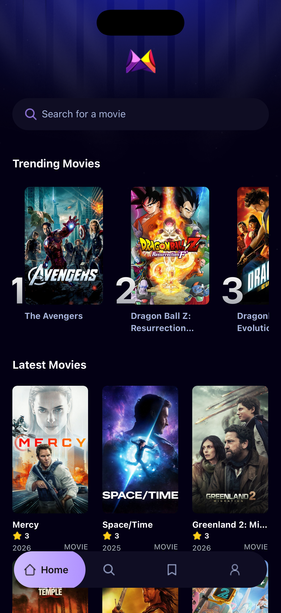
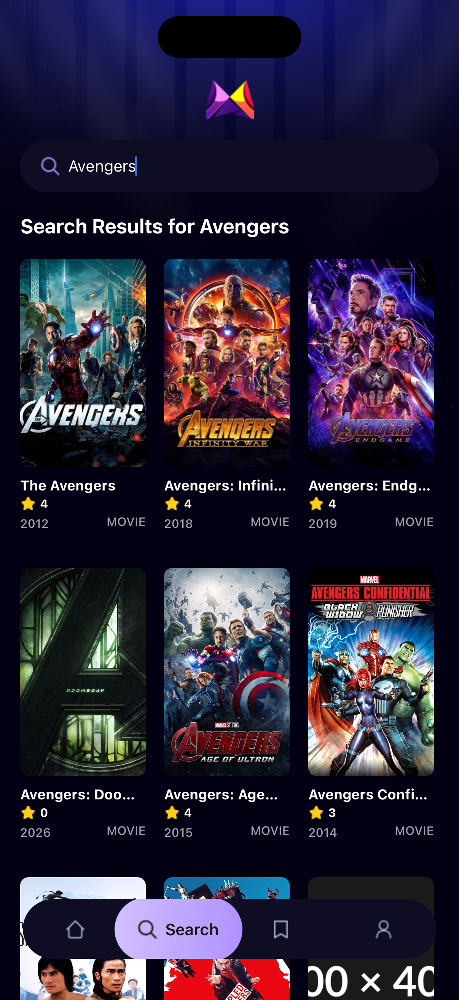

# 🎬 Movie Flex

A modern, cross-platform mobile movie discovery app built with React Native and Expo that lets you browse, search, and explore movies with real-time trending analytics.

---

## 📖 Overview

**Movie Flex** is a sleek movie browsing application that integrates with **The Movie Database (TMDb) API** to provide users with comprehensive movie information. The app features:

- 🔍 **Real-time movie search** with instant results
- 🔥 **Trending movies** based on actual user search behavior
- 📊 **Detailed movie information** including ratings, budgets, and production details
- 📱 **Cross-platform support** for iOS, Android, and Web
- 🎨 **Modern UI** with custom color scheme and smooth animations
- ☁️ **Cloud-powered analytics** using Appwrite TablesDB for tracking search trends

### Target Audience
- Movie enthusiasts looking to discover new films
- Users who want quick access to movie information
- Anyone seeking a beautiful, intuitive movie browsing experience

### **App Screenshots**

<p align="center">
  
  &nbsp;&nbsp;
  
</p>

---

## 🛠️ Tech Stack

### **Languages & Frameworks**
- **TypeScript** - Type-safe development
- **React Native** (0.81.5) - Cross-platform mobile framework
- **React** (19.1.0) - UI component library
- **Expo SDK** (~54.0) - Development platform and tooling

### **Styling & UI**
- **NativeWind** (4.2.1) - Tailwind CSS for React Native
- **TailwindCSS** (3.4.19) - Utility-first CSS framework
- Custom color palette with dark theme

### **Navigation & Routing**
- **Expo Router** (6.0.23) - File-based routing
- **React Navigation** (7.x) - Native navigation library
- Bottom tabs navigation pattern

### **Backend & Services**
- **TMDb API** - Movie data and metadata
- **Appwrite** (TablesDB) - Cloud database for analytics
- **React Native Appwrite** (0.24.0) - Appwrite SDK

### **Additional Libraries**
- **Expo Image** - Optimized image component
- **React Native Reanimated** - Advanced animations
- **React Native Gesture Handler** - Touch gesture system
- **MaskedView** - Creative UI masking effects

### **Development Tools**
- **ESLint** - Code linting
- **Prettier** - Code formatting
- **TypeScript** compiler
- **Expo CLI** - Development tooling

---

## 🏗️ Architecture

### **Folder Structure**

```
movie-app/
├── app/                          # File-based routing (Expo Router)
│   ├── (tabs)/                   # Tab-based navigation screens
│   │   ├── index.tsx            # Home screen (trending + latest movies)
│   │   ├── search.tsx           # Search functionality with debouncing
│   │   ├── saved.tsx            # Saved movies (placeholder)
│   │   ├── profile.tsx          # User profile (placeholder)
│   │   └── _layout.tsx          # Tab navigation configuration
│   ├── movie/
│   │   └── [id].tsx             # Dynamic movie details screen
│   ├── _layout.tsx              # Root layout with StatusBar config
│   └── global.css               # Global styles (Tailwind)
│
├── components/                   # Reusable UI components
│   ├── MovieCard.tsx            # Grid movie card with poster & rating
│   ├── TrendingCard.tsx         # Horizontal trending card with rank badge
│   └── SearchBar.tsx            # Search input component
│
├── services/                     # API and data management
│   ├── api.ts                   # TMDb API integration
│   ├── appwrite.ts              # Appwrite TablesDB client & methods
│   └── usefetch.ts              # Custom data fetching hook
│
├── constants/                    # Static assets configuration
│   ├── icons.ts                 # Icon asset exports
│   └── images.ts                # Image asset exports
│
├── interfaces/                   # TypeScript type definitions
│   └── interfaces.d.ts          # Movie, TrendingMovie, MovieDetails types
│
├── types/                        # Additional type declarations
│   └── images.d.ts              # Image module declarations
│
├── assets/                       # Static assets
│   ├── icons/                   # App icons
│   ├── images/                  # Images and backgrounds
│   ├── fonts/                   # Custom fonts
│   └── readme/                  # Documentation screenshots
│
├── tailwind.config.js           # TailwindCSS configuration
├── tsconfig.json                # TypeScript configuration
├── app.json                     # Expo app configuration
├── package.json                 # Dependencies and scripts
└── .env                         # Environment variables (not committed)
```

### **Core Modules**

#### **1. Routing (app/)**
- Uses Expo Router's file-based routing system
- Tab navigation for main screens (Home, Search, Saved, Profile)
- Dynamic routing for individual movie details (`/movie/[id]`)

#### **2. Data Layer (services/)**
- **api.ts**: Fetches movie data from TMDb API
  - `fetchMovies()` - Search or discover movies
  - `fetchMovieDetails()` - Get detailed movie information
- **appwrite.ts**: Manages search analytics using Appwrite TablesDB
  - `updateSearchCount()` - Increments search count for movies (with atomic operations)
  - `getTrendingMovies()` - Retrieves top searched movies
  - `testAppwriteConnection()` - Connection health check
- **usefetch.ts**: Custom React hook for async data fetching with loading/error states

#### **3. UI Components (components/)**
- **MovieCard**: Displays movie poster, title, rating, and year in grid layout
- **TrendingCard**: Horizontal card with masked ranking badge
- **SearchBar**: Reusable search input with custom styling

#### **4. State Management**
- Uses React hooks (useState, useEffect)
- Custom `useFetch` hook for data fetching lifecycle
- No global state management library (intentionally lightweight)

### **Data Flow**

1. **User Action** → Component event handler
2. **API Call** → `services/api.ts` fetches from TMDb
3. **Data Processing** → Custom hook manages loading/error/success states
4. **Analytics** → `services/appwrite.ts` tracks search metrics
5. **UI Update** → React re-renders with new data

---

## 🚀 Setup Instructions

### **Prerequisites**

- **Node.js** (v18+ recommended)
- **npm** or **yarn**
- **Expo CLI** (optional, included in project)
- **Expo Go app** (for mobile testing) - Download from App Store/Play Store
- **TMDb API Key** - [Get one here](https://www.themoviedb.org/settings/api)
- **Appwrite Account** - [Sign up at cloud.appwrite.io](https://cloud.appwrite.io)

### **Step 1: Clone the Repository**

```bash
git clone <repository-url>
cd movie-app
```

### **Step 2: Install Dependencies**

```bash
npm install
```

### **Step 3: Configure Environment Variables**

Create a `.env` file in the root directory:

```bash
touch .env
```

Add the following variables (see [Environment Variables](#-environment-variables) section for details):

```env
EXPO_PUBLIC_MOVIE_API_KEY=your_tmdb_api_key_here

EXPO_PUBLIC_APPWRITE_PROJECT_ID=your_appwrite_project_id
EXPO_PUBLIC_APPWRITE_PROJECT_NAME=your_project_name
EXPO_PUBLIC_APPWRITE_ENDPOINT=https://cloud.appwrite.io/v1
EXPO_PUBLIC_APPWRITE_DATABASE_ID=your_database_id
EXPO_PUBLIC_APPWRITE_TABLE_ID=your_table_id
```

### **Step 4: Configure Appwrite Database**

1. **Create an Appwrite Project**
   - Go to [Appwrite Console](https://cloud.appwrite.io/console)
   - Create a new project
   - Copy the **Project ID**

2. **Create a Database**
   - Navigate to Databases → Create Database
   - Copy the **Database ID**

3. **Create a Table** (for search metrics)
   - Table name: `metrics` (or any name, update `EXPO_PUBLIC_APPWRITE_TABLE_ID`)
   - Add the following columns:
     - `searchTerm` (String, 255 chars)
     - `movie_id` (String, 255 chars)
     - `title` (String, 255 chars)
     - `count` (Integer)
     - `poster_url` (String, 2000 chars)

4. **Set Permissions**
   - Go to Settings → Permissions
   - Add permission: **Any** with **Read**, **Create**, **Update** access

### **Step 5: Run the Application**

```bash
npm start
```

This will:
- Start the Expo development server
- Display a QR code in the terminal
- Open Expo DevTools in your browser

### **Step 6: Open on Device**

**Option A: Physical Device**
1. Install **Expo Go** from App Store (iOS) or Play Store (Android)
2. Scan the QR code with your camera (iOS) or Expo Go app (Android)

**Option B: Simulator/Emulator**
```bash
npm run ios      # iOS Simulator (macOS only)
npm run android  # Android Emulator
npm run web      # Web browser
```

---

## 📜 Available Scripts

| Command | Description |
|---------|-------------|
| `npm start` | Start the Expo development server |
| `npm run android` | Open app in Android emulator |
| `npm run ios` | Open app in iOS simulator (macOS only) |
| `npm run web` | Open app in web browser |
| `npm run lint` | Run ESLint for code quality checks |
| `npm run reset-project` | Reset project to initial state |

---

## 🔐 Environment Variables

Create a `.env` file in the project root with the following variables:

```env
# TMDb API Configuration
# Get your API key from: https://www.themoviedb.org/settings/api
EXPO_PUBLIC_MOVIE_API_KEY=your_tmdb_bearer_token_here

# Appwrite Configuration
# Project ID from your Appwrite console
EXPO_PUBLIC_APPWRITE_PROJECT_ID=your_project_id

# Optional: Project name for reference
EXPO_PUBLIC_APPWRITE_PROJECT_NAME="movie_app"

# Appwrite API endpoint (use regional endpoint for better performance)
# Options: https://cloud.appwrite.io/v1 or regional like https://nyc.cloud.appwrite.io/v1
EXPO_PUBLIC_APPWRITE_ENDPOINT=https://cloud.appwrite.io/v1

# Database ID from Appwrite console
EXPO_PUBLIC_APPWRITE_DATABASE_ID=your_database_id

# Table/Collection ID for storing search metrics
EXPO_PUBLIC_APPWRITE_TABLE_ID=metrics
```

### **Environment Variable Details**

| Variable | Purpose | How to Get It |
|----------|---------|---------------|
| `EXPO_PUBLIC_MOVIE_API_KEY` | TMDb API authentication | 1. Sign up at [TMDb](https://www.themoviedb.org)<br>2. Go to Settings → API<br>3. Copy the "API Read Access Token" (Bearer token) |
| `EXPO_PUBLIC_APPWRITE_PROJECT_ID` | Appwrite project identifier | From Appwrite Console → Project Settings |
| `EXPO_PUBLIC_APPWRITE_ENDPOINT` | Appwrite API URL | Use `https://cloud.appwrite.io/v1` or regional endpoint |
| `EXPO_PUBLIC_APPWRITE_DATABASE_ID` | Database identifier | Create database in Appwrite Console |
| `EXPO_PUBLIC_APPWRITE_TABLE_ID` | Table name for analytics | Table/Collection name (default: `metrics`) |

> **Note**: All variables prefixed with `EXPO_PUBLIC_` are exposed to the client-side code. Never use this prefix for sensitive server-side secrets.

---

## 📱 How to Use the Application

### **User Flow**

#### **1. Home Screen**
- View **Trending Movies** based on what other users are searching
- Browse **Latest Movies** in a grid layout
- Tap the search bar to navigate to search screen
- Tap any movie card to view details

#### **2. Search Screen**
- Type a movie name in the search bar
- Results appear instantly (debounced after 500ms)
- Search queries are automatically tracked for trending analytics
- Tap any movie to view full details

#### **3. Movie Details Screen**
- View movie poster and trailer button (UI only)
- See detailed information:
  - Release year and runtime
  - IMDb-style rating (votes count)
  - Full synopsis/overview
  - Genres
  - Budget and revenue
  - Production companies
- Tap "Go Back" to return

#### **4. Other Tabs**
- **Saved**: Placeholder for future saved movies feature
- **Profile**: Placeholder for user profile

### **Key Features in Action**

**Trending Algorithm**:
- When users search for a movie, it increments that movie's search count
- The top 5 most-searched movies appear on the home screen
- Uses Appwrite's atomic `incrementRowColumn()` for race-condition-free counting

**Search Tracking**:
```typescript
// Automatically triggered on search
updateSearchCount("Inception", movieData)
// → Creates new entry or increments existing count
```

---

## 🧪 Testing Instructions

### **Manual Testing**

1. **Test Appwrite Connection**
   ```bash
   npm start
   ```
   Check the terminal for:
   ```
   🔍 Testing Appwrite connection...
   ✅ Appwrite connected successfully!
   📊 Found X total rows in table
   ```

2. **Test Movie Search**
   - Navigate to Search tab
   - Type "Avengers"
   - Verify results appear
   - Check terminal for logs:
     ```
     🔍 Searching for: Avengers
     📽️ Movies loaded: 20
     💾 Updating search count for: The Avengers
     ```

3. **Test Trending Movies**
   - Search for multiple movies
   - Return to home screen
   - Verify trending section shows your recent searches

### **Testing Framework**

⚠️ **Needs configuration**: This project does not currently include automated tests.

**Recommended setup for future testing:**
- **Jest** - Unit testing
- **React Native Testing Library** - Component testing
- **Detox** - E2E testing

---

## 🚢 Deployment

### **Building for Production**

#### **iOS (macOS required)**
```bash
# Install EAS CLI
npm install -g eas-cli

# Configure and build
eas build --platform ios
```

#### **Android**
```bash
# Build APK
eas build --platform android

# Or build locally
npm run android -- --variant=release
```

#### **Web**
```bash
npm run web
# Build static files
npx expo export:web
```

### **Expo Application Services (EAS)**

This project is configured for EAS Build and Submit:

1. **Create Expo account**: [expo.dev](https://expo.dev)
2. **Install EAS CLI**: `npm install -g eas-cli`
3. **Configure**: `eas build:configure`
4. **Build**: `eas build --platform all`
5. **Submit**: `eas submit --platform ios/android`

### **CI/CD**

⚠️ **Needs configuration**: No CI/CD pipeline currently configured.

**Recommended tools:**
- **GitHub Actions** - Automated builds and tests
- **EAS Build** - Cloud builds for iOS/Android
- **Netlify/Vercel** - Web deployment

---

## 🤝 Contributing Guide

### **Branch Strategy**

```
main          # Production-ready code
├── develop   # Integration branch (create if needed)
└── feature/* # Feature branches
```

### **Contribution Workflow**

1. **Fork the repository**
2. **Create a feature branch**
   ```bash
   git checkout -b feature/your-feature-name
   ```
3. **Make your changes**
   - Follow existing code style
   - Use TypeScript types
   - Follow Tailwind class naming conventions
4. **Test your changes**
   ```bash
   npm run lint
   npm start # Manual testing
   ```
5. **Commit with descriptive messages**
   ```bash
   git commit -m "feat: add movie favoriting functionality"
   ```
6. **Push and create Pull Request**
   ```bash
   git push origin feature/your-feature-name
   ```

### **Pull Request Expectations**

- ✅ Clear description of changes
- ✅ Screenshots/videos for UI changes
- ✅ No ESLint errors
- ✅ TypeScript type safety maintained
- ✅ Tested on at least one platform (iOS/Android/Web)

### **Code Style**

- Use **TypeScript** for all new files
- Follow **React Hooks** patterns
- Use **Tailwind classes** via NativeWind (avoid inline styles)
- Keep components small and focused
- Use functional components (no class components)

---

## 🐛 Troubleshooting

### **Common Issues**

#### **1. "Appwrite connection failed"**

**Symptoms:**
```
❌ Appwrite connection failed: [AppwriteException: ...]
```

**Solutions:**
- ✅ Verify `.env` file exists and has correct values
- ✅ Check Appwrite project is active in console
- ✅ Ensure table permissions allow Read/Create/Update for "Any"
- ✅ Confirm endpoint URL is correct (include `/v1`)
- ✅ Restart Expo dev server: `npm start --reset-cache`

#### **2. "Movie images not loading"**

**Symptoms:** Grey placeholders instead of movie posters

**Solutions:**
- ✅ Check internet connection
- ✅ Verify TMDb API key is valid (test at [TMDb API docs](https://developers.themoviedb.org/3))
- ✅ Check API key format (should be Bearer token, not API key)
- ✅ Clear Expo cache: `npm start -c`

#### **3. "Module not found" errors**

**Symptoms:**
```
Error: Unable to resolve module @/services/api
```

**Solutions:**
- ✅ Delete `node_modules`: `rm -rf node_modules`
- ✅ Reinstall: `npm install`
- ✅ Clear Metro cache: `npm start -- --reset-cache`
- ✅ Verify path aliases in `tsconfig.json`

#### **4. "Invalid document structure" in Appwrite**

**Symptoms:**
```
AppwriteException: Invalid document structure: Attribute "X" has invalid type
```

**Solutions:**
- ✅ Check table schema matches expected data types:
  - `movie_id`: String (not Integer)
  - `count`: Integer
  - All fields have correct max lengths
- ✅ Recreate table with correct schema
- ✅ Check for null values being sent

#### **5. Expo Go app shows blank screen**

**Solutions:**
- ✅ Check terminal for errors
- ✅ Shake device → Reload
- ✅ Ensure `.env` file is present (restart after adding)
- ✅ Check all required environment variables are set
- ✅ Try web version: `npm run web`

#### **6. TypeScript errors in IDE**

**Solutions:**
- ✅ Restart TypeScript server in VSCode: Cmd+Shift+P → "Restart TS Server"
- ✅ Delete `.expo` folder and restart
- ✅ Run `npx tsc --noEmit` to see all errors

#### **7. Search not working / no results**

**Solutions:**
- ✅ Check terminal logs for API errors
- ✅ Verify TMDb API key has "API Read Access" permissions
- ✅ Test API directly: `curl -H "Authorization: Bearer YOUR_TOKEN" https://api.themoviedb.org/3/search/movie?query=test`
- ✅ Check network inspector in browser (web version)

---

## 📄 License

⚠️ **Needs configuration**: No license file currently present in the repository.

**Recommended**: Add a `LICENSE` file with your chosen license (e.g., MIT, Apache 2.0, GPL-3.0).

---

## 🙏 Acknowledgments

- **TMDb** - Movie data and images
- **Appwrite** - Cloud database and backend services
- **Expo** - Development platform
- **React Native Community** - UI components and libraries

---

## 📞 Support

For issues and questions:
- 🐛 [Open an issue](../../issues)
- 💬 Check existing issues and discussions
- 📖 Read [Expo documentation](https://docs.expo.dev)
- 🎬 Review [TMDb API docs](https://developers.themoviedb.org)
- ☁️ Check [Appwrite documentation](https://appwrite.io/docs)

---

<div align="center">
  <p>Built with ❤️ using React Native and Expo</p>
  <p>⭐ Star this repo if you find it helpful!</p>
</div>
